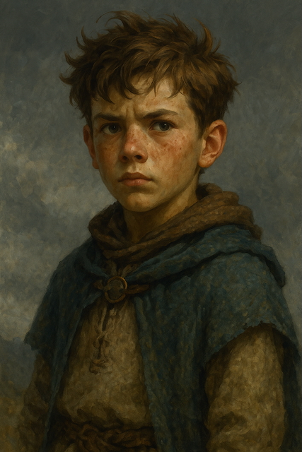

# Tibun

---

## Allgemeine Informationen

<table>
  <tbody>
    <tr>
      <td colspan="2" style="text-align: center; background-color: #e0e0e0;"><strong>Allgemein</strong></td>
    </tr>
    <tr>
      <td><strong>Rolle</strong></td>
      <td>Protagonist</td>
    </tr>
    <tr>
      <td><strong>Alter</strong></td>
      <td>15 Jahre / 25 Jahre</td>
    </tr>
    <tr>
      <td><strong>Herkunft</strong></td>
      <td></td>
    </tr>
    <tr>
      <td colspan="2" style="text-align: center; background-color: #e0e0e0;"><strong>Familie</strong></td>
    </tr>
    <tr>
      <td><strong>Mutter</strong></td>
      <td><a href="../girlin/girlin.md">Girlin</a></td>
    </tr>
    <tr>
      <td><strong>Vater</strong></td>
      <td><a href="../../nebenfiguren.md#semban">Semban</a></td>
    </tr>
    <tr>
      <td><strong>Schwester</strong></td>
      <td><a href="../../nebenfiguren.md#tara">Tara</a></td>
    </tr>
  </tbody>
</table>

---

## Frühes Leben

Tibun wächst in einem einfachen Dorf auf. Nach dem mysteriösen Verschwinden seiner Mutter durch einen aktivierten Portalring begibt er sich auf die Suche nach ihr.

---

## Besondere Fähigkeiten

- Neugierig und wissbegierig
- Entdeckt durch Zufall die Eigenschaften von Elektrizität

---

## Bedeutung in der Geschichte

Tibun ist die zentrale Figur der Handlung und treibt die Entdeckung der Portalringe voran.

---

## Verbindungen zu anderen Charakteren

- Mutter: [Girlin](../girlin/girlin.md)  
- Vater: [Semban](../../nebenfiguren.md#semban)
- Schwester: [Tara](../../nebenfiguren.md#tara)
- Verbündete: [Bellbrim](../../bellbrim/bellbrim.md)

---

## Inspiration

- Schauspieler: [Name](https://example.com)

---

## Weitere Bilder

